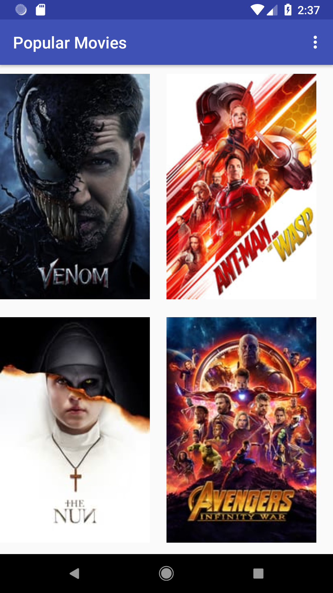
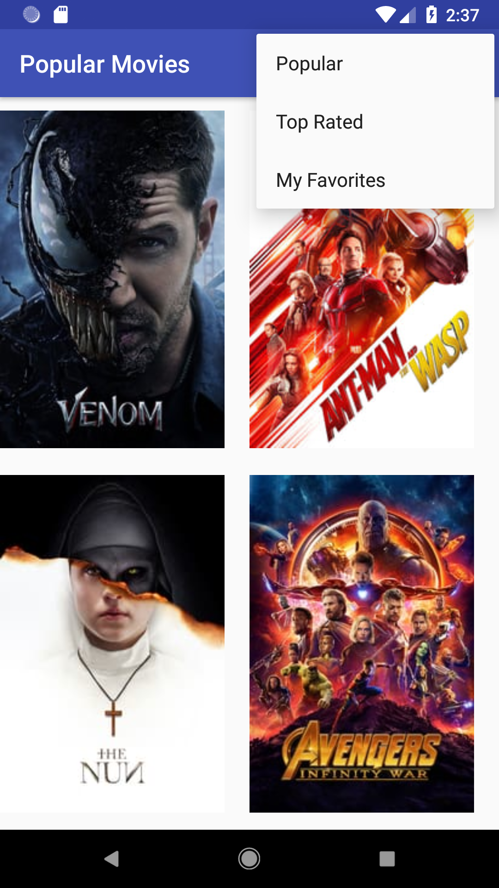
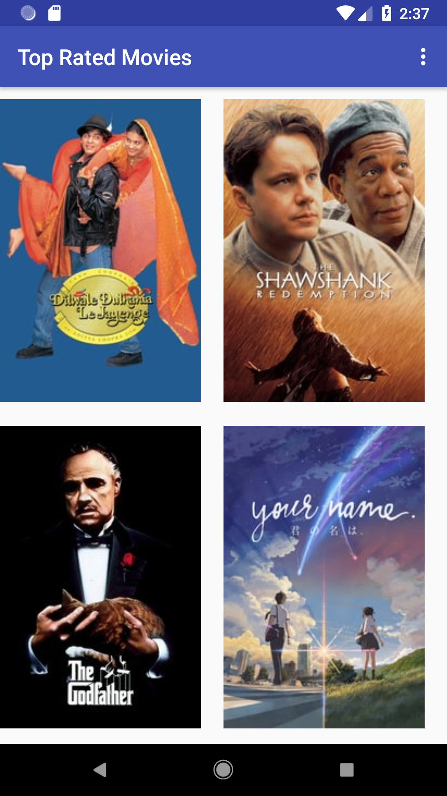
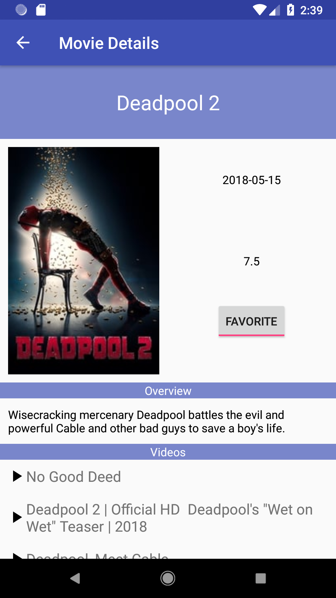
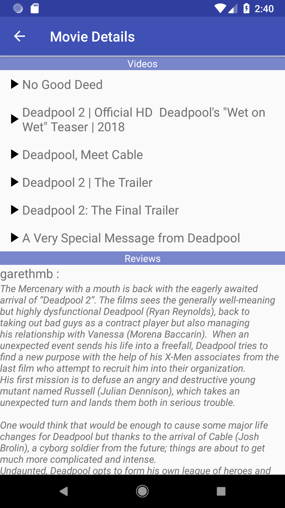

# PopularMoviesStage2
Android Developer Nanodegree project that allows users to discover the most popular/Top Rated movies playing and build Favorites collection

## API Notes
Since this application uses a RESTful API to retrieve movie data, an API key is required to query The Movie DB. For privacy and Terms of Service reasons, the API key has been removed from this public repo. To run and review the application, you can register for an API key by signing up for an account at https://www.themoviedb.org/account/signup

## App Features
* View movies sorted by either "Most Popular" or "Top Rated"
* Mark movies as favorite, to be viewed under a collection of favorites
* Watch and movie trailers from YouTube
* Read users reviews for each movie

## Concepts Applied
* Android Architecture components (LiveData, ViewModel, Room)
* Lifecycle awareness
* App Executors for Threading
* SQLite Database (not re-queried unnecessarily)
* REST calls to The Movie DB API
* Implicit Intents to launch the YouTube app

## Libraries used
* Butter Knife
* Retrofit
* Picasso
* Room
* Lifecycle (LiveData and ViewModel)

## Screenshots

